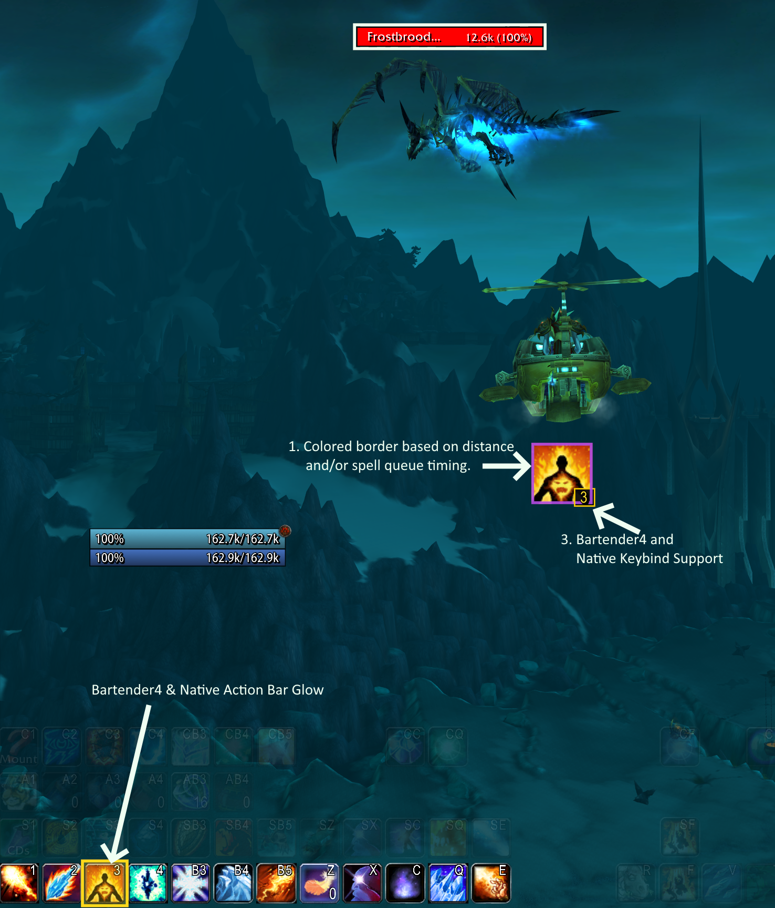
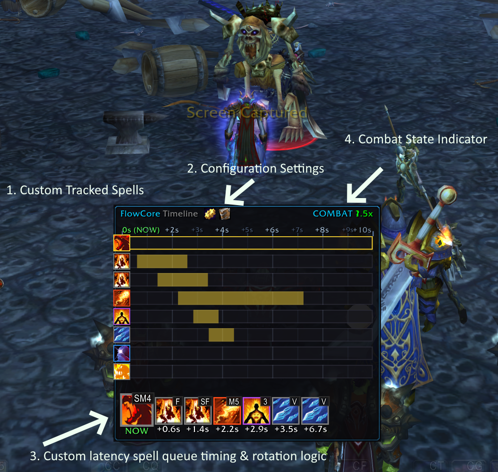
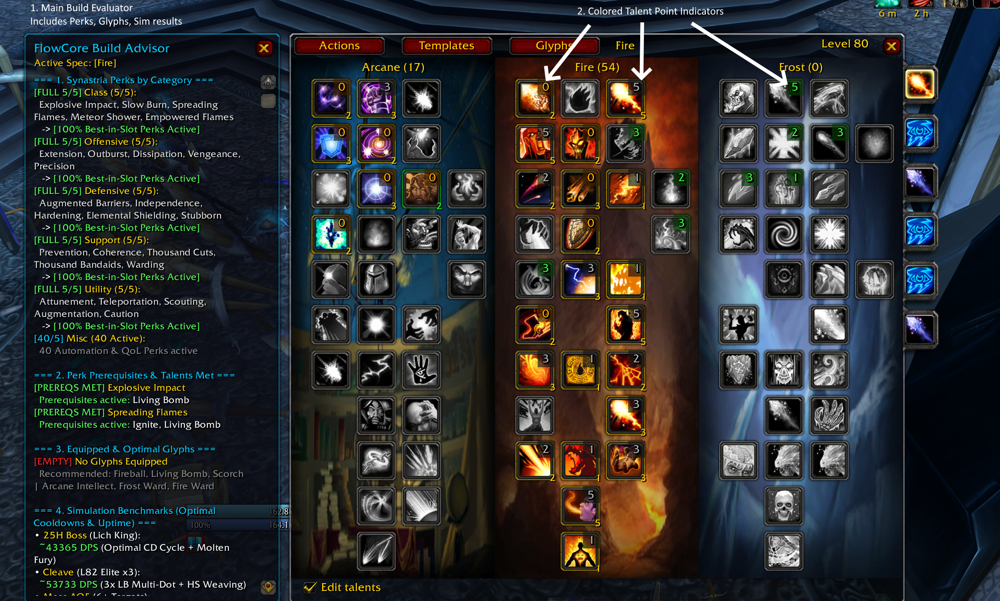
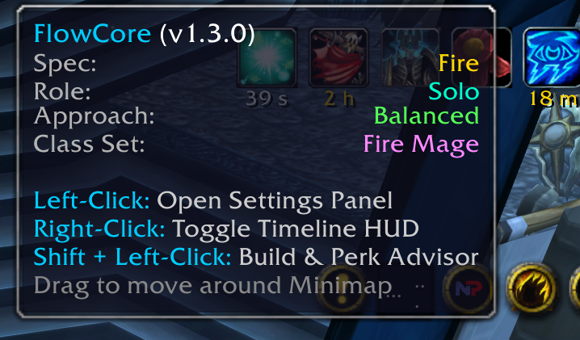
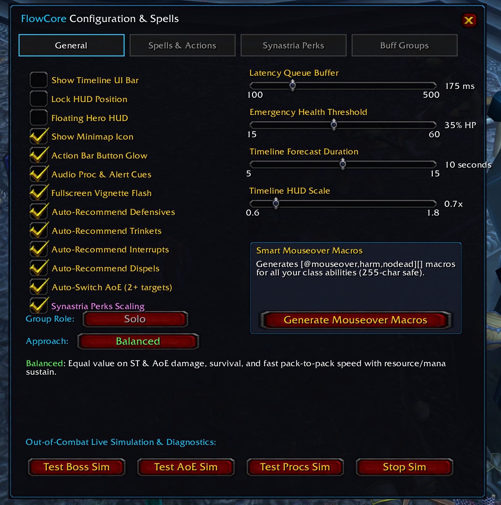

# FlowCore (v1.3.0)

> **Real-Time Spell Recommendation, 10-Second Predictive Timeline Engine & Build Advisor for World of Warcraft 3.3.5a (WotLK / Synastria / ChromieCraft / AzerothCore)**

---

## 📖 Overview

**FlowCore** is a high-performance, real-time combat intelligence and rotational optimization engine designed specifically for World of Warcraft 3.3.5a (Wrath of the Lich King). Built from the ground up to support all 10 classes and 30+ talent specializations, FlowCore bridges deep character math with modern HUD visualizations and native **Synastria** server features.

FlowCore dynamically analyzes your equipped gear, gems, enchants, talent tree distributions, major/minor glyphs, active Synastria custom perks, target time-to-death (TTD), and active tanking status to provide millisecond-accurate rotational guidance and a 10-second predictive forecast.

---

## 📸 Screenshots & UI Layout

| Floating Hero HUD & Action Bar Glow | EventHorizon Multi-Track Timeline |
| :---: | :---: |
| <br>*Next recommended cast, keybind badge, reactive proc glow, and latency queue indicator.* | <br>*10-second multi-track cast forecast, ground tick intervals, and DoT expirations.* |

| Full Talent, Perk & Simulation Advisor | Interactive Minimap Button & Status Tooltip |
| :---: | :---: |
| <br>*Side-panel keystone evaluation, BiS perk scoring, and Lich King 25H DPS sims.* | <br>*Draggable minimap icon showing active spec, role, combat approach, and class perk sets.* |

| In-Game Configuration Panel | Custom Spell and Ability Management |
| :---: | :---: |
|  <br>*Approach selection, latency compensation sliders* |  |

---

## ⚡ Key Features

### 1. 🎯 Floating Hero HUD & Action Bar Glow Injection
- **Immediate Cast Guidance**: Displays the highest-scoring action calculated for your current combat state.
- **Keybind Badges**: Automatically detects and displays your keybinds from default action bars and **Bartender4**.
- **Reactive Proc Glows**: Dynamic animated border glow when keystones proc (`Hot Streak`, `Brain Freeze`, `The Art of War`, `Killing Machine`, `Sudden Death`, `Bloodsurge`, `Maelstrom Weapon`, `Nightfall`).
- **Action Bar Button Glow**: Directly illuminates the corresponding button on your action bars.
- **Latency Queue Indicator**: Visual cue during your custom latency window (100–500ms before GCD expiry) to safely queue the next spell without clipping.

### 2. ⏳ 10-Second Predictive Timeline Engine
- **EventHorizon Multi-Track Mode**: Visualizes concurrent spell cast channels, DoT tick durations, ground AoE intervals (`Flamestrike`, `Blizzard`, `Death and Decay`, `Consecration`), and cooldown recovery bars.
- **Icon Sequence Mode**: Clean, linear queue of the next 8 planned actions forecasted chronologically.
- **60 FPS Hardware Ticker**: Smooth, fluid scrolling animations decoupled from combat frame spikes.

### 3. ⚔️ Four Specialized Combat Approaches
FlowCore adapts its entire scoring, talent weighting, and perk recommendations based on your chosen approach:

- **🟢 Balanced** *(Default)*: Equal value on Single Target, AoE, and survival. Actively monitors resource depletion ($< 35\%$ Mana/Energy/Rage) and prioritizes sustain abilities (`Evocation`, `Life Tap`, `Mana Gem`, `Innervate`, `Bloodrage`, `Tiger's Fury`, `Aspect of the Viper`) for continuous pack-to-pack speed.
- **🟠 ST Damage**: Maximizes Single Target boss DPS, execute phase optimization, and single-target stat scaling.
- **🔵 AOE Damage**: Maximizes $3+$ target multi-dotting, ground hazards, and trash clearing.
- **🔴 Survival / PVP**: Emphasizes Stamina ($2.0\times$), Armor ($1.8\times$), Damage Reduction, Resilience, Shields/Wards, and passive health recovery.

### 4. 🔮 Synastria Custom Server Integration
- **Dynamic Perk Tooltip Parser**: Parses perk tooltips directly from server memory, extracting spell damage multipliers, school bonuses, crit damage %, haste, hit, shield absorption %, range bonuses, and damage reduction.
- **5/5 Category Limit Enforcement**: Strictly categorizes perks into Offensive (5), Defensive (5), Support (5), Utility (5), Class (5), and Misc (prestige, loot, mount perks).
- **Class Perk Set Bonuses**: Supports 4pc and 5pc set bonuses (e.g. Fire Mage `+125% Fire Damage, -30% Dmg taken from Ignited enemies`).
- **Custom Item Tags & Forges**: Native support for `GetItemTagsCustom` bitmasks, Mythic item scaling ($1.65\times$), and Lightforged / Titanforged / Warforged item scoring.

### 5. 📊 Holistic Build Advisor & Simulation Engine (`/fc build`)
- **Keystone Synergy Evaluation**: Hooks into `Talented` and standard Blizzard talent frames, highlighting optimal synergies vs. missing talents.
- **Live Simulation Benchmarks**:
  - *25H Raid Boss* (The Lich King - 103.2M HP / 180s simulation).
  - *Cleave* (Level 82 Elite Mobs - 3 Targets).
  - *Mass AOE* (6+ Target Trash Pack).
  - *Speed & Range* (Effective GCD floor & spell reach).
  - *Survivability & EHP* (Effective Health Pool calculated from armor, damage reduction, and absorption capacity).
- **Gear & Upgrade Audit (`/fc gearcheck`, `/fc upgrades`)**: Scans equipped gear for un-enchanted slots and empty gem sockets; scans bags, bank, and mailbox for higher-scoring upgrade candidates.

### 6. 🐾 Universal Multi-Class & Pet Spellbook Support
- Scans player spellbook tabs *and* pet spellbooks (`BOOKTYPE_PET`).
- Full support for Hunter (`Kill Command`, `Mend Pet`), Warlock (`Spell Lock`, `Sacrifice`), Unholy DK (`Gnaw`, `Huddle`), and Frost Mage (`Freeze`).

---

## 🛠️ Installation

1. Download or clone this repository into your World of Warcraft 3.3.5a AddOns directory:
   ```
   World of Warcraft/Interface/AddOns/FlowCore/
   ```
2. Ensure the directory is named strictly `FlowCore` (without `-master` or version suffixes).
3. Start or restart your WoW client, open the **AddOns** list at the character selection screen, and ensure `FlowCore` is checked (with *Load out of date AddOns* enabled).
4. In-game, type `/fc` or `/reload` to initialize.

---

## 🎮 How to Use FlowCore

### Opening the Configuration Panel
- Click the **FlowCore Minimap Icon**, click the gear button on the timeline header, or type `/fc config`.
- **Tab 1: General**: Configure HUD toggles, queue window buffer, emergency health thresholds, Group Role, and Combat Approach.
- **Tab 2: Spells & Actions**: Customize individual spell priorities, toggle timeline tracking, or perform bulk category modifications.
- **Tab 3: Synastria Perks**: View all discovered custom perks, active category slot counts (5/5), and set bonuses.
- **Tab 4: Buff Groups**: Manage priority rankings for mutually exclusive aura groups (e.g. Mage Armors, Paladin Seals/Blessings, Priest Fortitude/Spirit, Warlock Armors).

### Quick-Action Minimap Icon
- **Left-Click**: Open Configuration Panel.
- **Right-Click**: Toggle Timeline HUD Bar.
- **Shift + Left-Click**: Open Talent, Perk & Simulation Build Advisor.
- **Left-Click + Drag**: Move icon freely around the minimap border.

---

## ⌨️ Slash Command Cheatsheet

| Command | Description |
| :--- | :--- |
| `/fc` | Print FlowCore command overview |
| `/fc config` | Open in-game configuration window |
| `/fc build` | Open Talent, Perk, & Simulation Build Advisor |
| `/fc approach <balanced\|st\|aoe\|survival>` | Change Combat Approach mode |
| `/fc role <dps\|tank\|healer\|solo>` | Change Group Role for threat alerts |
| `/fc sim [single\|aoe\|proc\|stop]` | Start out-of-combat live simulation |
| `/fc weights` | Display relative stat weights and DPS values for active spec |
| `/fc caps` | Audit Hit, Expertise, Haste, and Defense caps (Normal vs Mythic) |
| `/fc gearcheck` | Audit equipped gear for missing enchants and empty gem sockets |
| `/fc upgrades` | Scan Bags, Bank, and Mailbox for equippable gear upgrades |
| `/fc perks` | Inspect active Synastria custom perks and set bonuses |
| `/fc glyphs` | Inspect equipped major/minor glyphs and rotational bonuses |
| `/fc gcd` | Diagnostic inspection of effective haste GCD, current GCD, and queue window |
| `/fc why` | Explain the real-time scoring logic behind the current recommended cast |
| `/fc macro` | Automatically generate Character-Specific mouseover macros (255-char safe) |
| `/fc ui` | Toggle Timeline HUD bar |
| `/fc lock` | Lock or unlock HUD position for dragging |
| `/fc minimap` | Toggle minimap button visibility |
| `/fc check` | Run full engine and combat vitals diagnostics |
| `/fc rescan` | Perform full rescan of spellbook, pet abilities, items, and perks |

---

## 🏆 Credits & Acknowledgements

FlowCore is developed with inspiration, code references, and API integration from several outstanding projects in the World of Warcraft community:

- **[SynastriaCoreLib](https://github.com/imevul/SynastriaCoreLib)**: Native server APIs, custom perk memory structures, item tag bitmasks, and packet hooks for Synastria custom mechanics.
- **[ChromieCraft](https://www.chromiecraft.com/) / [AzerothCore](https://github.com/azerothcore/azerothcore-wotlk)**: The open-source 3.3.5a server core powering our development and testing sandbox.
- **EventHorizon**: Visual timeline concept and multi-track spell visualization architecture for classic WoW combat.
- **Hekili**: Priority queue principles and predictive rotational modeling.
- **Talented**: Talent tree frame hooks and build template integration for 3.3.5a.
- **Bartender4 / ActionButtonLib**: Action bar keybind indexing and button glow overlay hooks.

---

## 📄 License
FlowCore is distributed under the MIT License for the World of Warcraft emulation and modding community.
